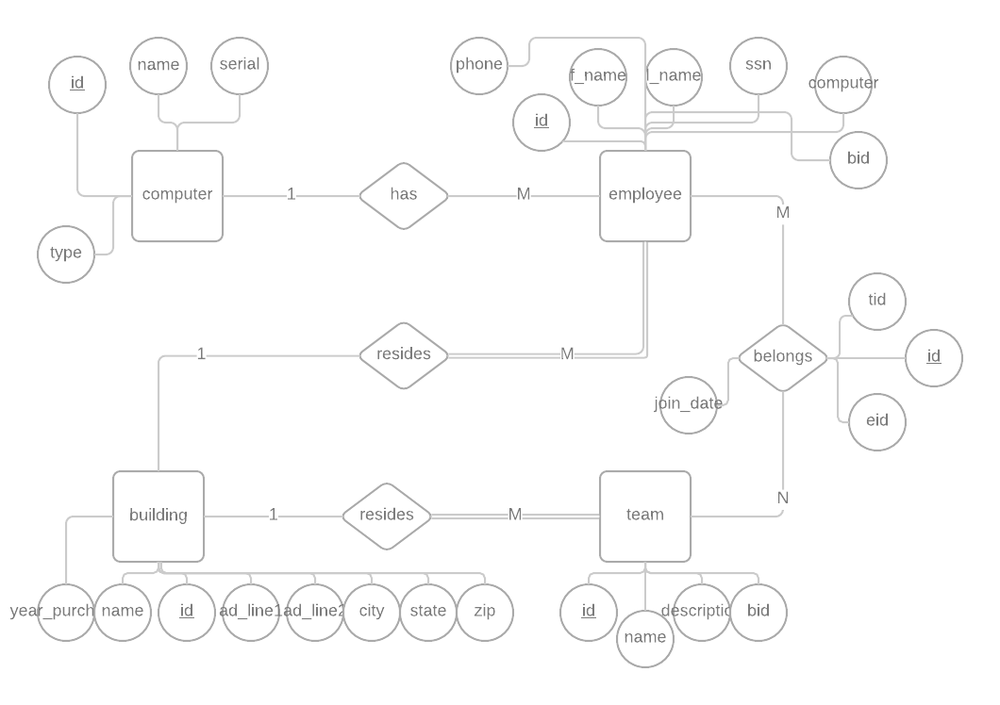

# CS340 Final Project

## Outline
My final project is different than my proposed project in order to reudce the number of many to many relationships, and to increase my interest in the project

I will model a very simple company. The company is made up of a collection of buildings, computers, employees, and teams.

Employees can have a phone number, can have a computer, must havea first/last name/SSN, and they must work in a single building.

Computers must have a name, can have a type description, and can have a serial number. Multiple people can use the same computer.

Teams must have a name, can have a description, can have several associated employees (MANY TO MANY) and must be associated with a building. An empty tem can exist without an employee. When a member joins a team, the time they join is recorded. Not all employees must be on a team.


Buildings must have a name, an address broken down into appropriate datafields (1st line, 2nd line(optional), city, state and zip) and must have the year purchased. A building can exist without having any active employee or teams working there. Buildings can be associated with numerous teams and employees.

## ER Diagram

## Schema

## Data Definition Queries

```
CREATE TABLE computer (
    id int NOT NULL AUTO_INCREMENT PRIMARY KEY,
    name VARCHAR(255),
    type VARCHAR(255),
    serial INT
) ENGINE=InnoDB DEFAULT CHARSET=utf8;

CREATE TABLE building (
  id INT NOT NULL AUTO_INCREMENT PRIMARY KEY,
  name VARCHAR(255),
  ad_line1 VARCHAR(255) NOT NULL,
  ad_line2 VARCHAR(255),
  city VARCHAR(255) NOT NULL,
  state VARCHAR(255) NOT NULL,
  zip VARCHAR(255) NOT NULL,
  year_purchased INT NOT NULL
) ENGINE=InnoDB DEFAULT CHARSET=utf8;

CREATE TABLE team (
  id INT NOT NULL AUTO_INCREMENT PRIMARY KEY,
  name VARCHAR(255) NOT NULL,
  description VARCHAR(255),
  bid INT NOT NULL,
  FOREIGN KEY (bid) REFERENCES building (id) ON DELETE RESTRICT ON UPDATE CASCADE
) ENGINE=InnoDB DEFAULT CHARSET=utf8;


CREATE TABLE employee (
  id INT NOT NULL AUTO_INCREMENT PRIMARY KEY,
  f_name VARCHAR(255) NOT NULL,
  l_name VARCHAR(255) NOT NULL,
  ssn INT(8) NOT NULL,
  phone VARCHAR(255),
  bid INT NOT NULL,
  computer INT,
  FOREIGN KEY (computer) REFERENCES computer (id),
  FOREIGN KEY (bid) REFERENCES building (id) ON DELETE RESTRICT ON UPDATE CASCADE,
) ENGINE=InnoDB DEFAULT CHARSET=utf8;

CREATE TABLE works_on (
  id INT NOT NULL AUTO_INCREMENT PRIMARY KEY,
  eid INT,
  tid INT,
  join_date DATETIME DEFAULT CURRENT_TIMESTAMP,
  CONSTRAINT team_person UNIQUE (eid, tid),
  FOREIGN KEY (eid) REFERENCES employee (id) ON DELETE RESTRICT ON UPDATE CASCADE,
  FOREIGN KEY (tid) REFERENCES team (id) ON DELETE RESTRICT ON UPDATE CASCADE
) ENGINE=InnoDB DEFAULT CHARSET=utf8;
```
  

## Data Maniuplation Queries
This section contains the MySQL code that drives the website viewing. Do not include javascript. Represent all variables that the user would input.

```
// To filter all team/employee database interctions, user selects a team to look at
SELECT works_on.id, f_name, l_name, team.name, works_on.join_date FROM
    works_on JOIN team ON works_on.tid = team.id
    JOIN employee ON works_on.eid = employee.id
    WHERE team.id = [**teamIDInput**];
    
// To filter all the different teams based on which building they work in
SELECT team.name, description, building.name AS buildName 
    FROM team JOIN building ON team.bid = building.id 
    WHERE building.id = [**buildingIDInput**];
    
// Select employee by which building htey work in
SELECT f_name, l_name, ssn, phone, building.name AS buildName 
    FROM employee JOIN building ON employee.bid = building.id 
    WHERE building.id = [**buildingIDInput**];
    
// User selects computers based on serial number size
SELECT * FROM computer WHERE serial [**serialInput**]

// User filters building on the year purchased
SELECT * FROM building WHERE year_purchased > [yearInput]
```


\


## Project link
My final project can be found at this link.

## Thank you
I wanted to thank botht the professor, and all the hard working TA's. I think it is important to acknolwedge that the skeleton of this project was forked from the [Professor's example code](https://github.com/wolfordj/CS340-Sample-Web-App).


